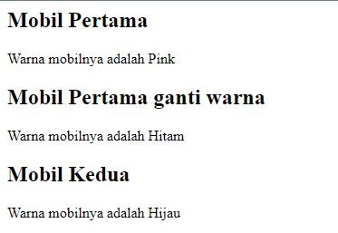
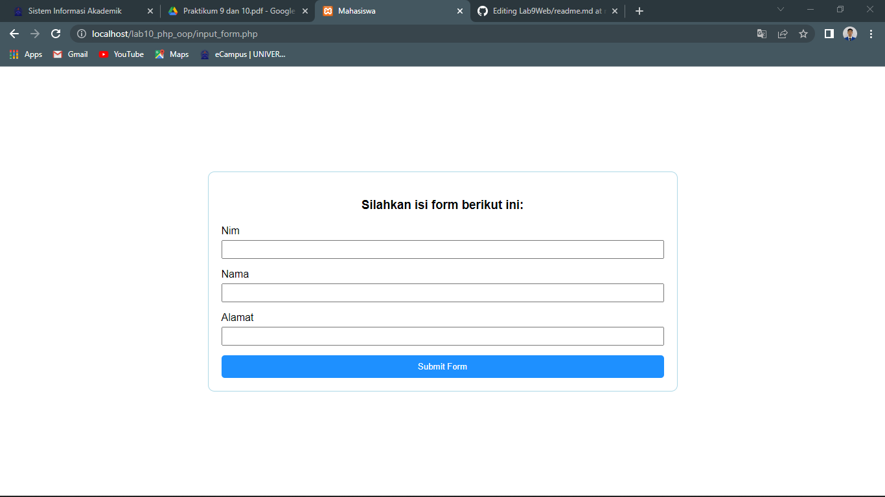

# Tugas Lab 9 Web

## Profil
| # | Biodata |
| -------- | --- |
| **Nama** | Reza Riyaldi Irawan |
| **NIM** | 312010284 |
| **Kelas** | TI.20.A.2 |
| **Mata Kuliah** | Pemrograman Web |

## Langkah 1 `Class Dasar`
1. Buat file baru bernama `Mobil.php`, lalu tambahkan kode berikut.

```php
<?php

class Mobil
{
    private $warna;
    private $merk;
    private $harga;

    public function __construct()
    {
        $this->warna = "Pink";
        $this->merk = "Lamborgini";
        $this->harga = "1_000_000_000";
    }

    public function set_warna($value)
    {
        $this->warna = $value;
    }

    public function get_warna()
    {
        return "Warna mobilnya adalah " . $this->warna;
    }
}

// Deklarasi class
$mobil_pertama = new Mobil();
$mobil_kedua = new Mobil();

// Memanggil object
?>

<h2>Mobil Pertama</h2>

<?= $mobil_pertama->get_warna(); ?>

<h2>Mobil Pertama ganti warna</h2>

<?php
$mobil_pertama->set_warna("Hitam");
echo $mobil_pertama->get_warna(); 
?>

<h2>Mobil Kedua</h2>

<?php
$mobil_kedua->set_warna("Hijau");
echo $mobil_kedua->get_warna();

```

2. Maka hasilnya akan seperti berikut.



## Langkah 2 `Membuat Form`
1. Buat file baru bernama `Form.php`, lalu tambahkan kode berikut.

```php
<?php

class Form
{
    private $fields = [];
    private $action;
    private $submit = "Submit Form";
    private $jumlah_field = 0;

    public function __construct($action, $submit)
    {
        $this->action = $action;
        $this->submit = $submit;
    }

    public function display_form()
    {
?>
        <form action="<?= $this->action ?>" method="post">
            <?php for ($j = 0; $j < count($this->fields); $j++) : ?>
                <div class="form-group">
                    <label for=""><?= $this->fields[$j]['label'] ?></label>
                    <input type="text" name="<?= $this->fields[$j]['name'] ?>">
                </div>
            <?php endfor ?>
            <button type="submit" value="<?= $this->submit ?>"><?= $this->submit ?></button>
        </form>
<?php
    }

    public function add_field($name, $label)
    {
        $this->fields[$this->jumlah_field]['name'] = $name;
        $this->fields[$this->jumlah_field]['label'] = $label;
        $this->jumlah_field++;
    }
}

```

2. Buat file baru bernama `input_form.php`, lalu tambahkan kode berikut.

```php
<?php
include "Form.php";
?>

<!DOCTYPE html>
<html lang="en">

<head>
    <meta charset="UTF-8">
    <meta http-equiv="X-UA-Compatible" content="IE=edge">
    <meta name="viewport" content="width=device-width, initial-scale=1.0">
    <title>Mahasiswa</title>

    <link rel="stylesheet" href="style.css">
</head>

<body>
    <div class="container">
        <?php
        $form = new Form("", "Submit Form");
        $form->add_field('nim', 'Nim');
        $form->add_field('nama', 'Nama');
        $form->add_field('alamat', 'Alamat');
        ?>

        <h3>Silahkan isi form berikut ini:</h3>
        <?php $form->display_form() ?>
    </div>
</body>

</html>
```
3. Tambahkan sedikit style agar lebih menarik.

```css
* {
    padding: 0;
    margin: 0;
    font-family: sans-serif;
}

body {
    height: 100vh;
    display: flex;
    justify-content: center;
    align-items: center;
}

.container {
    width: 50%;
    border-radius: 10px;
    border: 1px solid lightblue;
    padding: 20px;
}

h3 {
    text-align: center;
    margin: 20px;
}

.form-group {
    width: 100%;
    display: flex;
    flex-direction: column;
}

.form-group input {
    padding: 5px;
    margin: 5px 0 15px;
}

button {
    background-color: dodgerblue;
    width: 100%;
    border: none;
    border-radius: 5px;
    color: white;
    padding: 10px;
}
```

4. Maka hasilnya seperti berikut.

